# MIRA LINK USER FLOWS

This document describes UX flow architecture only. It does not alter the current domain contract, implementation or integration boundaries. There are 18 flows: 7 Guest, 4 Waiter, 3 Admin and 4 cross-role flows. Promotions remain contextual (Home, Venue Detail, Nearby or explicit CTA) and open GST-038 Promotion Detail as a mobile bottom sheet; Account is a parent area with separate Profile, Loyalty, History, Favourites, Notifications and Communication Settings screens.

## Guest Flows

### GF-01 — QR/NFC → table join → order status

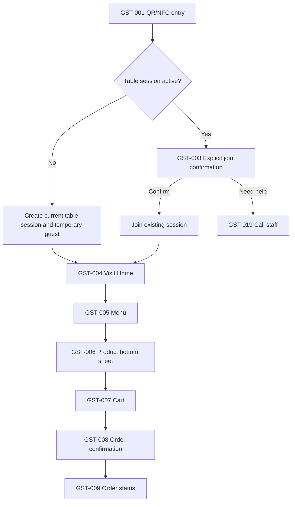

Entry error, expired session, invalid table and unavailable network enter GST-002, where retry and support are available. QR/NFC finds a context; it never bypasses the existing active-session join rule.

### GF-02 — Bill → Split → online payment → tips → success

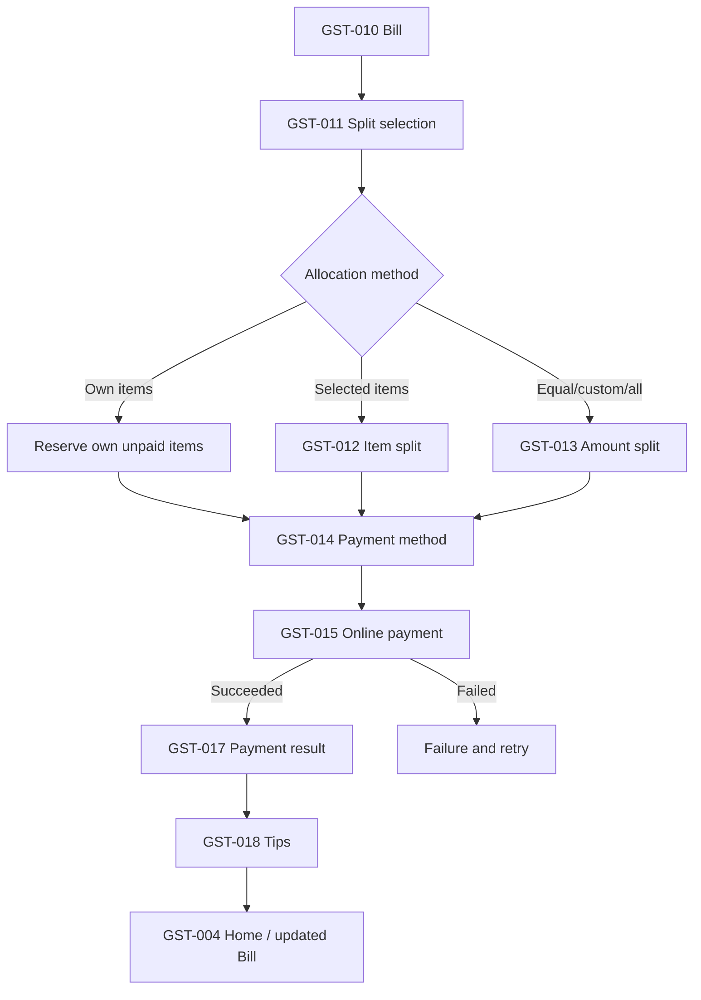

Split remains a pre-payment reservation. The financial split is created only after successful payment; neither is redesigned as a single UX/data concept.

### GF-03 — Cash request → waiter/POS confirmation → success

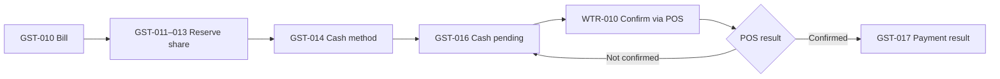

Guest cannot mark cash as paid. Existing POS confirmation remains the authority for that state transition.

### GF-04 — Call waiter → accepted → resolved

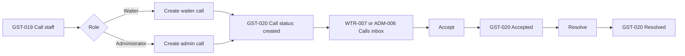

### GF-05 — Nearby → venue → menu preview → delivery

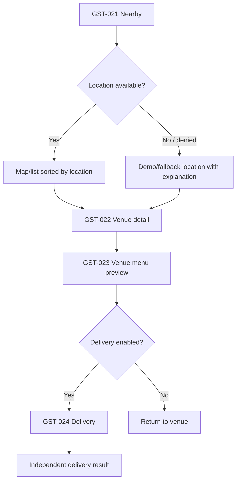

This never creates a table Session. Venue detail is public/discovery context, not a substitute for QR table entry.

### GF-06 — Event → detail → venue or booking

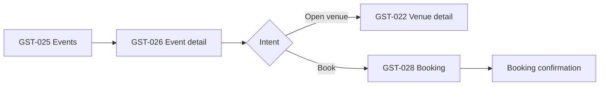

### GF-07 — Anonymous → authorised account

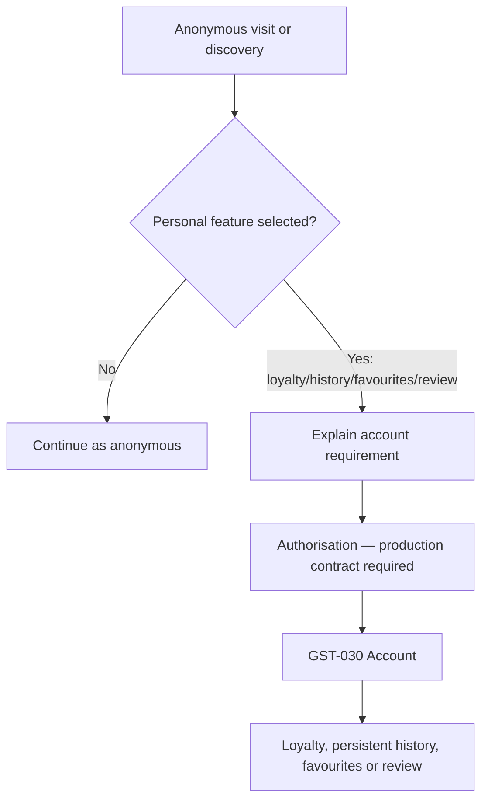

The current demo account toggle is a demonstration mechanism. Production authorisation is **PRODUCT DECISION REQUIRED** and must not interrupt order, payment or service access.

## Waiter Flows

### WF-01 — Shift → new order → POS → ready → served

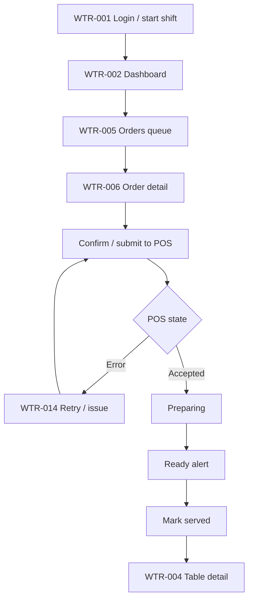

### WF-02 — Call → accept → table → resolve

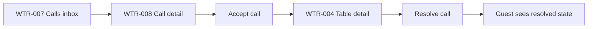

### WF-03 — Payment request → cash confirmation

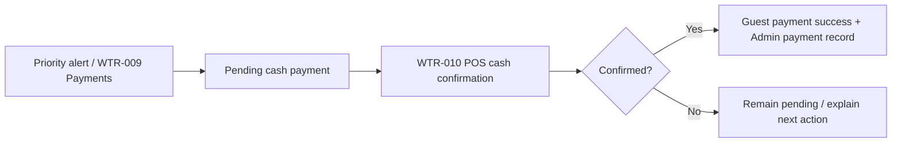

### WF-04 — Waiter-created order

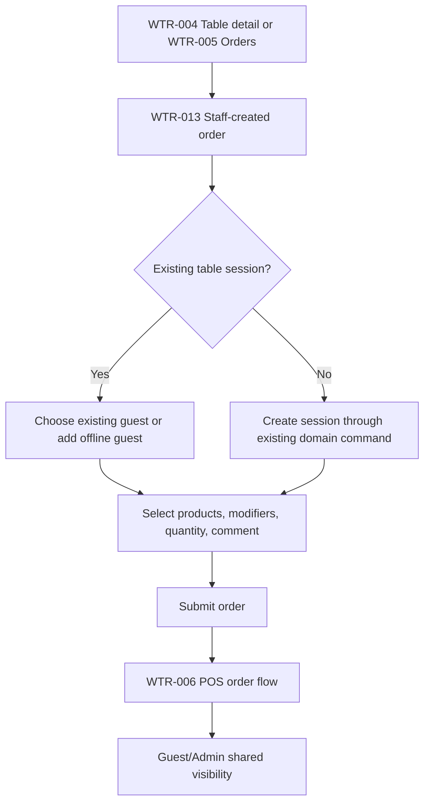

## Admin Flows

### AF-01 — Overview → orders → order detail

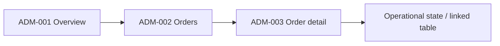

### AF-02 — Menu → product → price / availability / stop-list

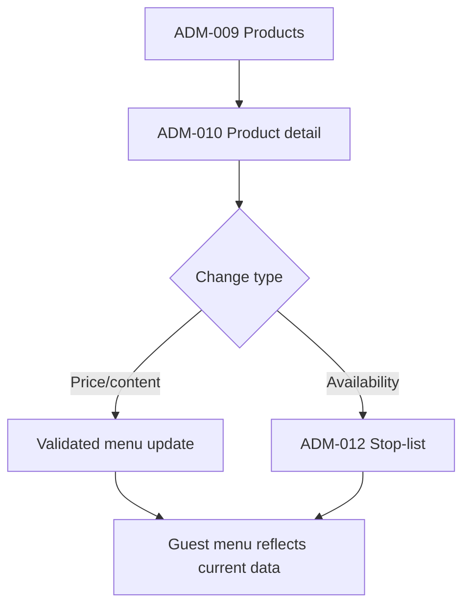

### AF-03 — Staff → employee → role

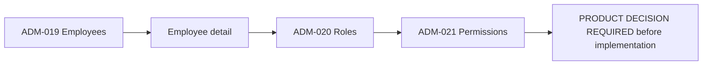

## Cross-role Flows

### XF-01 — Guest → Waiter → POS → Guest

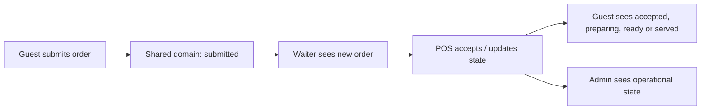

### XF-02 — Guest payment → Waiter / Admin

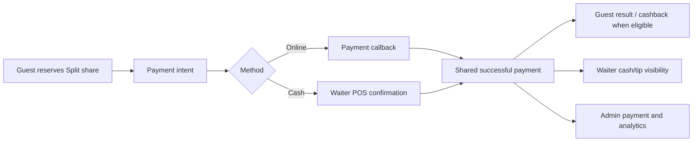

### XF-03 — Admin stop-list → Guest menu

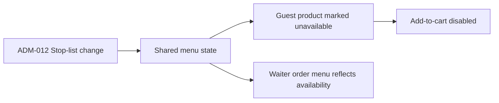

### XF-04 — Admin menu → Guest menu

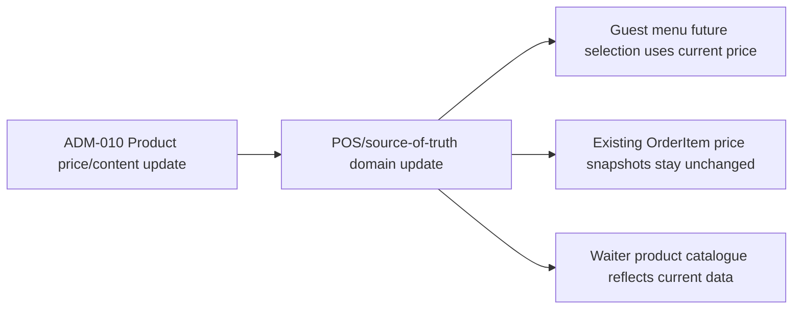

## Flow State Rules

- A Session is one visit and has at most one active instance per table.
- Order status and financial status stay distinct.
- A successful payment is immutable; a later order is a new order in the same Session.
- Split reservations prevent over-allocation and must show an understandable unavailable state.
- Service calls move through created, accepted and completed; visual state is not colour-only.
- Partner services and discovery browsing remain separate from restaurant Session state.
